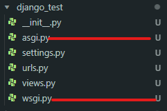
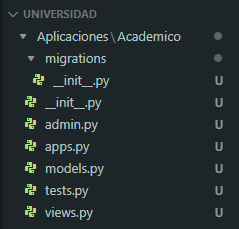
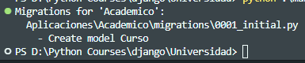
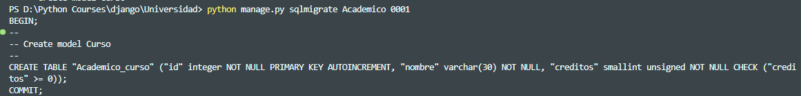
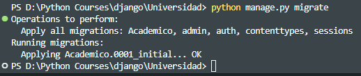
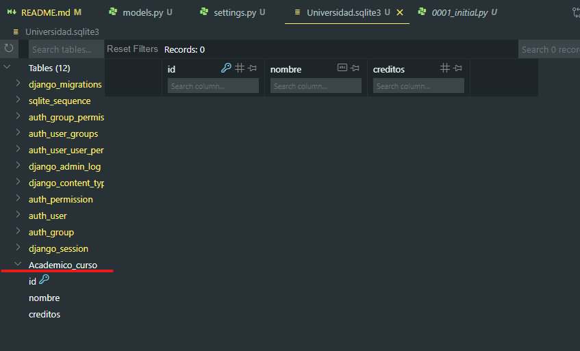

# Curso Django

Es un framework de Python para crear aplicaciones web, comenxxo a desarrollarse en el año de 2002,
pero se publica de forma oficial en el 2005.

Fomenta el desarrollo rápido y diseño limpio y pragmático ( muy ligado a la resolución de problemas en la práctica).
Muy apegado a la filosofia DRY ( Don't Repeat Yourself).

Sigue el modelo de arquitectura MTV( Model Template View).

- Modelo : Manipula los datos en la aplicación
- Template : Decide como se verán los datos en el navegador.
- View : Decide cuáles datos va a mostrar el template.

```sh
 pip intall django==3.0.8 # instalar django version 3.0.8

 django-admin startproject <name_project> # crear un proyecto

 python manage.py runserver # par ainiciar el servidor de django
```



- init.py -> Indica a python que la carpeta es un paquete
- asgi.py -> Asynchronous Server Gateway Interface
- wsgi.py Web Server Gateway Interface
- settings.py -> configuraciones del proyecto
- urls.py -> URLS del proyecto
- views.py -> vistas para el proyecto

#APP Universidad

```sh
 django-admin startproject Universidad # creación del proyecto
 django-admin startapp Academico # Creación de la aplicación
```



### ORM -> Object Relational Mapping

En el arechivo models, se crean los modelos de base de datos, ejem:

```py
class Curso(models.Model):
    nombre = models.CharField(max_length=30)
    creditos = models.PositiveSmallIntegerField()
```

El modelo se debe Mapear en settings.py del proyecto principal:

```py
INSTALLED_APPS = [
    'Aplicaciones.Academico'
]
```

Dentro de settings.py también se realiza la configuración a la Base de datos:

```py
DATABASES = {
    'default': {
        'ENGINE': 'django.db.backends.sqlite3',
        'NAME': 'Universidad.sqlite3',
    }
}
```

Para revisar si no hay errores en la aplicacion usar el siguiente comando:

```sh
python manage.py check
```

Para crear la base de datos ejecutar el comando:

```sh
python manage.py migrate
```

Para migrar el modelo a la base de datos ejecutar el sig comando:

```sh
python manage.py makemigrations
```



Para ver en SQL la creación de la tabla se puede utilizar el comando:

```sh
python manage.py sqlmigrate Academico 0001
```



Para pasar de la migración SQL en Django a SQLite3(o cualquier otra base de datos), se utiliza el comando:

```sh
python manage.py migrate
```




# Universidad - SQLite3

Ingresasr al shell del ORM

```sh
python manage.py shell
```

```sh
>>> from Aplicaciones.Academico.models import Curso # seleccionar la base de datos
>>>curso_uno = Curso(nombre = 'Algebra', creditos = 5) # generar el INSERT INTO
>>>curso_uno.save() # Guardar la sentencia y aplicarlo en la base de datos

>>>curso_tres = Curso.objects.create (nombre = 'Geografia', creditos = 10) #creea elñ objeto y lo guarda

# Actualización de la cantidad de créditos
>>> curso_cuatro = Curso.objects.create (nombre = 'Computacion', creditos = 10)
>>> curso_cuatro.creditos = 5
>>> curso_cuatro.save()
```

Cuando salimos de la shell pero queremos seleccionar un objeto de la base de datos,
se peude realizar lo siguiente:

```sh
#Seleccionar el modelo
>>> from Aplicaciones.Academico.models import Curso
# realizar un filtro por el id del objeto
>>> curso = Curso.objects.get(id=3)
>>> print(curso.nombre)
Geografia
#Una vez que tenewmos seleccionado el objeto, realizamos la actualización
>>> curso.creditos = 5
#Salvamos la modificación
>>> curso.save()

```

Para conocer todos los objetos de la base de datos, podemos tratar con:

```sh
#Invoca todos los cursos
>>> cursos =  Curso.objects.all()

#Muestra lso cursos en forma de objeto
>>> print(cursos)
<QuerySet [<Curso: Curso object (1)>, <Curso: Curso object (2)>, <Curso: Curso object (3)>, <Curso: Curso object (4)>]>

#podemos acceder a los datos de los cursos
>>> print(cursos[1].nombre)
Español

#podemos acceder al Query de base de datos
>>> cursos.query.__str__()
'SELECT "Academico_curso"."id", "Academico_curso"."nombre", "Academico_curso"."creditos" FROM "Academico_curso"'
>>>
```

Para eliminar un objeto de la base de datos, podemos realizar lo siguiente:

```sh
#Seleccionamos el curso a través de objects.get
>>> curso_eliminar = Curso.objects.get(id=2)

#nos aseguramos de que sea el curso que queremos eliminar
>>> print(curso_eliminar.nombre)
Español

#Eliminasmo el curso con el método delete()
>>> curso_eliminar.delete()
(1, {'Academico.Curso': 1}) # -> nos indica que se elimino un curso

```

# Universidad - PostgreSQL

```sh
# Creamos el entorno virtual
python -m venv env

#Activamos el entorno virtual
\env\Scripts\activate

#Instalamos Django en su verison 3.0.8
pip install django==3.0.8

#instalamos el driver de conexión con PostgrSQL
pip install psycopg2
```

Configuramos la base de datos en el archivo settings.py:

```py
DATABASES = {
    'default': {
        'ENGINE': 'django.db.backends.postgresql_psycopg2',
        'NAME': 'universidad',
        'USER': 'postgres',
        'PASSWORD': 'root',
        'HOST': '127.0.0.1',
        'DATABASE_PORT': '5432'
    }
}
```

Para migrar las tablas a postgres SQL usar el siguiente comando:

```sh
python manage.py migrate
```

Si sale un error como este:

```sh
raise AssertionError("database connection isn't set to UTC")
AssertionError: database connection isn't set to UTC
```

En la seccion de setings.py, colocar lo siguiente:

```py
USE_TZ = False
```

Por defecto esta en True, solo cambiar a False.

Para finalizar correr los siguientes comandos:

```sh
python manage.py makemigrations
>> No changes detected

python manage.py migrate
>>> Operations to perform:
  >>> Apply all migrations: Academico, admin, auth, contenttypes, sessions
>>> Running migrations:
  >>> No migrations to apply.
```

## CRUD PostgreSQL

```sh
#ingresamos a la shell
python manage.py shell
#importamos el modelo Curso
>>> from Aplicaciones.Academico.models import Curso
#incertamos un registro en la base de datos
>>> curso = Curso.objects.create(nombre = 'Ciencias Naturales', creditos = 5)
# Seleccionar todos los cursos
>>> cursos = Curso.objects.all()
>>> print(cursos)
#muestra los cursos en forato de objeto
<QuerySet [<Curso: Curso object (1)>, <Curso: Curso object (2)>, <Curso: Curso object (3)>, <Curso: Curso object (4)>]>

# usar exec para im primir todos los cursos en la temrinal
>>> exec("for curso in cursos : print('{0} - {1} - {2}'.format(curso.id, curso.nombre, curso.creditos))")
1 - Ciencias Naturales - 5
2 - Educación Física - 5
3 - Física - 5
4 - Quimica - 5

#Actualizamos los datos de un curso
>>> curso_editar = Curso.objects.get(id= 1)
>>> curso_editar.nombre = 'Inglés'
>>> curso_editar.creditos = 10
>>> curso_editar.save()

>>> cursos1 = Curso.objects.all()
>>> exec("for curso in cursos1 : print('{0} - {1} - {2}'.format(curso.id, curso.nombre, curso.creditos))")
2 - Educación Física - 5
3 - Física - 5
4 - Quimica - 5
1 - Inglés - 10

#Eliminamos un registro
curso_eliminar = Curso.objects.get(id= 4)
>>> print(curso_eliminar.nombre)
Quimica
>>> curso_eliminar.delete()
(1, {'Academico.Curso': 1})

>>> cursos2 = Curso.objects.all()
>>> exec("for curso in cursos2 : print('{0} - {1} - {2}'.format(curso.id, curso.nombre, curso.creditos))")
2 - Educación Física - 5
3 - Física - 5
1 - Inglés - 10
```

Motor de Plantillas Jinja - https://jinja.palletsprojects.com/en/3.1.x/intro/

Usamos Bootstrap v5.3

- Css

```html
<link
  href="https://cdn.jsdelivr.net/npm/bootstrap@5.3.1/dist/css/bootstrap.min.css"
  rel="stylesheet"
  integrity="sha384-4bw+/aepP/YC94hEpVNVgiZdgIC5+VKNBQNGCHeKRQN+PtmoHDEXuppvnDJzQIu9"
  crossorigin="anonymous"
/>
```

- JavaScript

```html
<script
  src="https://cdn.jsdelivr.net/npm/@popperjs/core@2.11.8/dist/umd/popper.min.js"
  integrity="sha384-I7E8VVD/ismYTF4hNIPjVp/Zjvgyol6VFvRkX/vR+Vc4jQkC+hVqc2pM8ODewa9r"
  crossorigin="anonymous"
></script>
<script
  src="https://cdn.jsdelivr.net/npm/bootstrap@5.3.1/dist/js/bootstrap.bundle.min.js"
  integrity="sha384-HwwvtgBNo3bZJJLYd8oVXjrBZt8cqVSpeBNS5n7C8IVInixGAoxmnlMuBnhbgrkm"
  crossorigin="anonymous"
></script>
```

Filtros en el ORM:

https://docs.djangoproject.com/en/4.2/ref/models/querysets/

## Creación de Usuarios

```sh
> python manage.py createsuperuser
Username (leave blank to use 'ricardo'): ricardo
Email address: ricardo.luna@hotmail.com
Password:
Password (again):
This password is too short. It must contain at least 8 characters.
This password is too common.
Bypass password validation and create user anyway? [y/N]: y
Superuser created successfully.

#verificamso que no existan migraciones
> python.exe manage.py makemigrations
No changes detected

#para hacer el reflejo con la base de datos
> python.exe manage.py migrate
```

Para cambiar el idioma del panel de administración, dentro del archivo settings.py,
colocar el idioma:

```py
LANGUAGE_CODE = 'es-mx'
```
